# Отчёт по задаче сегментации позвонков T1-T12

## Постановка задачи
Задача по сегментации позвонков T1-T12:
1. Скачать  датасет Pax-Ray ++(интересует только грудной отдел позвоночника, боковая проекция)
   1.1 Убрать лишние лейблы, подготовить к обучению модели.
2. На датасете из п.1 обучить свою модель (например, yolo11n-seg)
3. Собрать в интернете снимки грудного отдела позвоночника в боковой проекции с разного оборудования. Можно брать снимки всего позвоночника, обрезать их убрав шейный и поясничный отделы.
4. Протестировать модель на новых данных. При необходимости добавить препроцессинг (clahe и т.д.) в обучение и переобучить для лучшей работы модели с новыми источниками.
5. Предоставить отчёт по обучению (графики обучений, матрицы неточностей, примеры работы на новых данных не из датасета)

## Информация о данных и обучении

- **Источник:** PAX-Ray++ с Kaggle
- **Фильтрация:** Сохранены только боковые проекции грудного отдела позвоночника (T1-T12)
- **Подготовка данных:** Код фильтрации выполнен в Google Colab: [Фильтрация датасета в Google Colab](https://colab.research.google.com/drive/1Rt3yDxRA-7bnjzeH-4kk8lNZEYQeYJ_4?usp=sharing)
  **Архитектура модели:** YOLOv11n-seg 

## Результаты обучения

### Обзор процесса обучения
- **Длительность обучения:** 88 эпох (~22 467 секунд, около 6.2 часов)
- **Динамика потерь:** Все функции потерь устойчиво снижались в течение всего обучения

### Ключевые метрики качества (эпоха 88)

#### 1. Детекция (Bounding Box) - высокое качество
| Метрика | Значение | Интерпретация |
|---------|----------|---------------|
| **mAP@50** | 0.98158 | Почти идеальная детекция при стандартном пороге IoU |
| **mAP@50-95** | 0.73853 | Хорошее качество при строгих порогах |
| **Precision** | 0.96444 | Минимальное количество ложных срабатываний |
| **Recall** | 0.95746 | Пропущено менее 5% объектов |

*Модель демонстрирует отличную способность к точной локализации всех 12 грудных позвонков.*

#### 2. Сегментация (Mask) - удовлетворительное качество
| Метрика | Значение | Интерпретация |
|---------|----------|---------------|
| **mAP@50** | 0.94298 | Хорошее совпадение масок при пороге 50% |
| **mAP@50-95** | 0.54049 | Умеренное качество точных контуров |
| **Precision** | 0.92579 | Высокая точность сегментации |
| **Recall** | 0.90930 | Хорошая полнота сегментации |

*Качество построения контуров несколько ниже детекции, но остается приемлемым для данной задачи.*

### Динамика обучения по эпохам

#### Сравнение результатов на разных этапах обучения
| Метрика | После 1 эпохи | После 88 эпох |
|---------|---------------|---------------|
| **mAP@50(B)** | 0.630 | 0.982 |
| **mAP@50-95(B)** | 0.328 | 0.739 |
| **mAP@50(M)** | 0.483 | 0.943 |
| **mAP@50-95(M)** | 0.160 | 0.540 |

#### Анализ кривых обучения
- **Быстрый рост (эпохи 1-20):** Все ключевые метрики стремительно улучшались
- **Плавное улучшение (эпохи 20-60):** Модель оттачивала детали и тонкие особенности
- **Стабильность (эпохи 60-88):** После 60-й эпохи улучшения стали минимальными
- **Оптимальная точка остановки:** Эпохи 70-75, где метрики достигли максимума с минимальным приростом в дальнейшем

## Графики

|     BoxF1     |     BoxPR     |      BoxP     |      BoxR     |
|---------------|---------------|---------------|---------------|
| 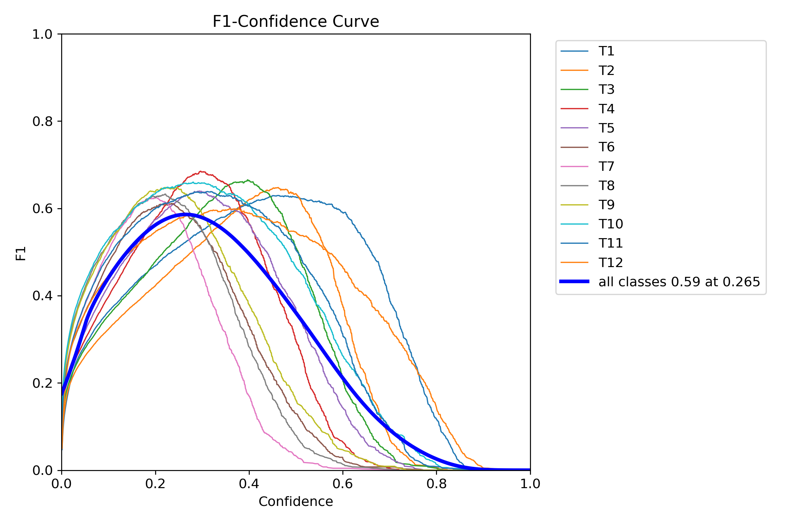  | 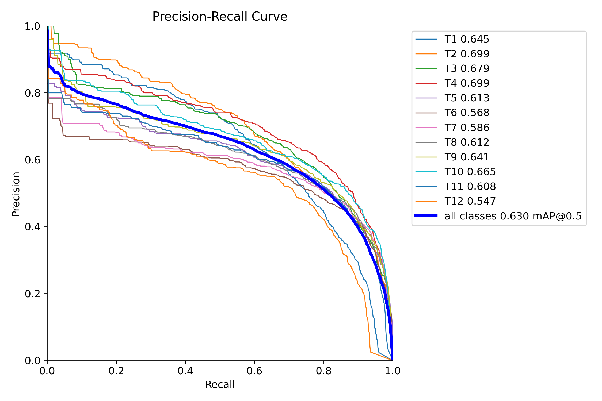  | 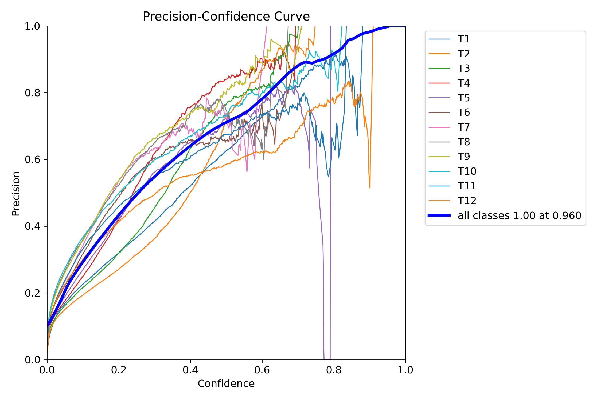  | 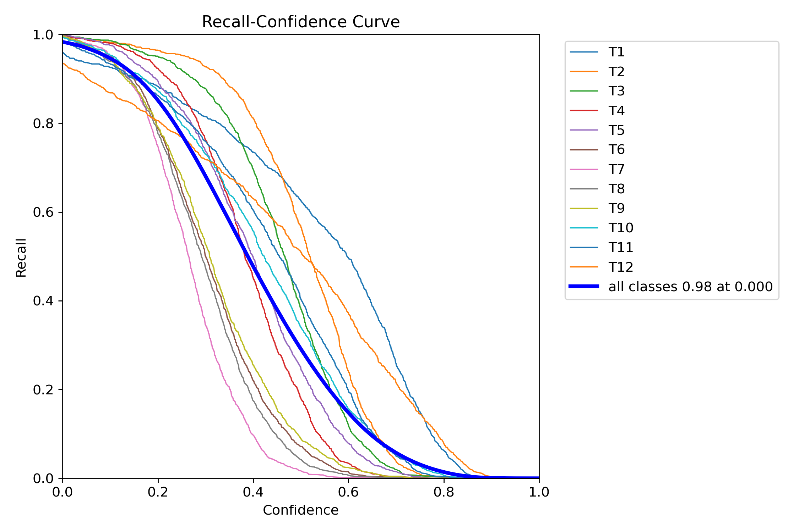  |

|     MaskF1    |     MaskPR    |      MaskP    |      MaskR    |
|---------------|---------------|---------------|---------------|
| 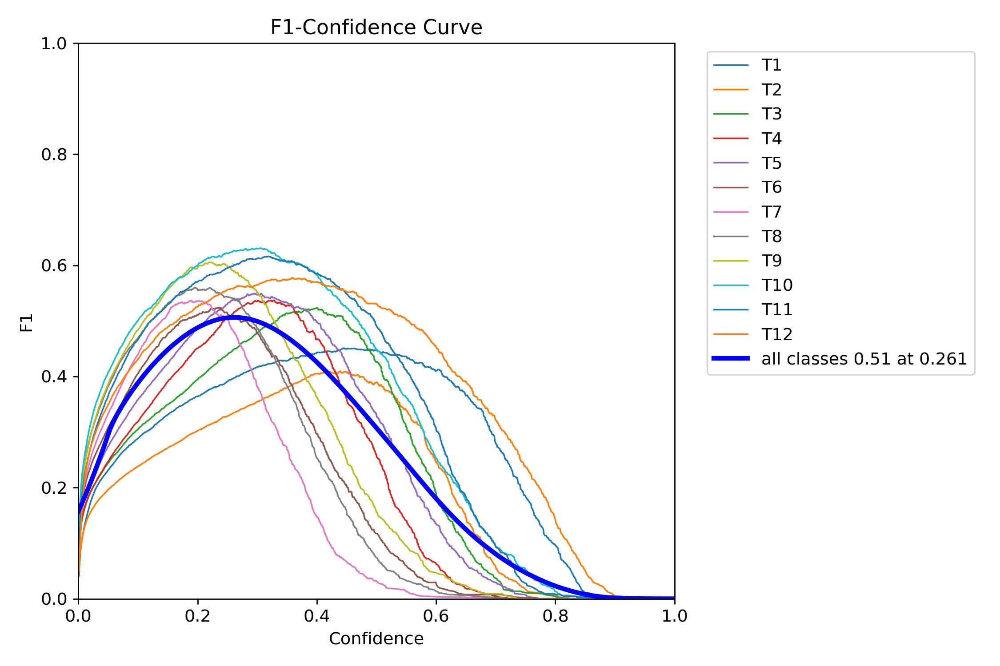  | 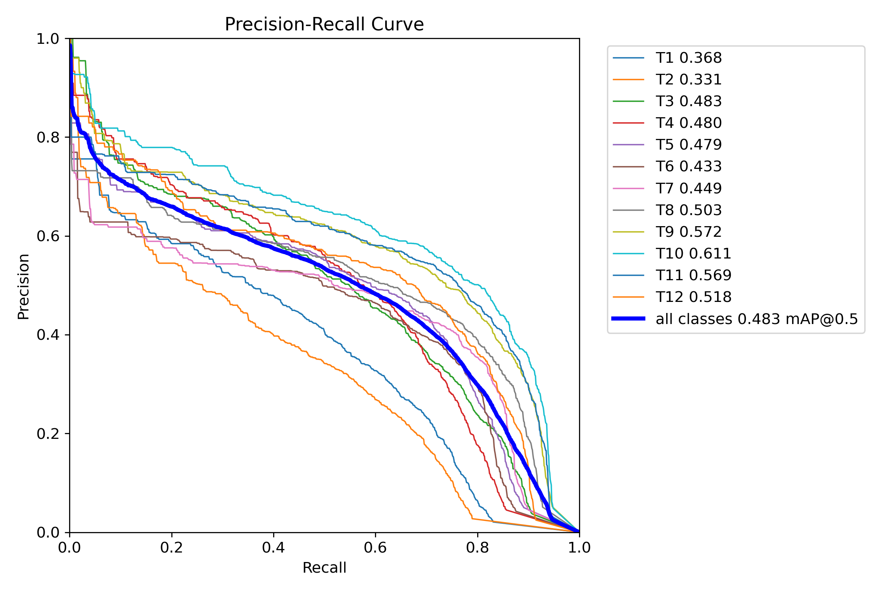  | 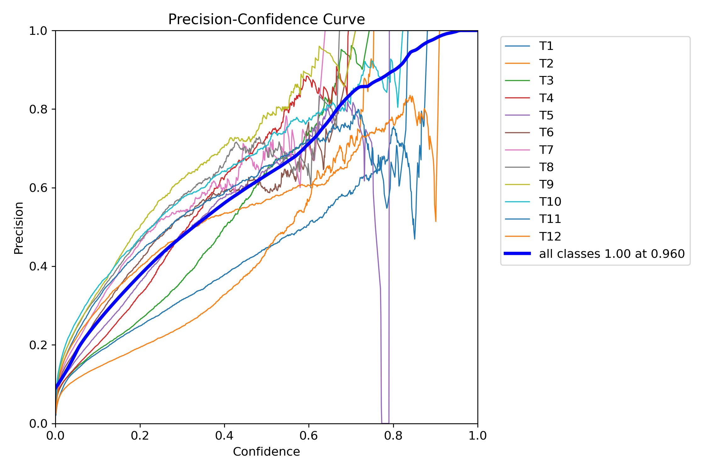  | 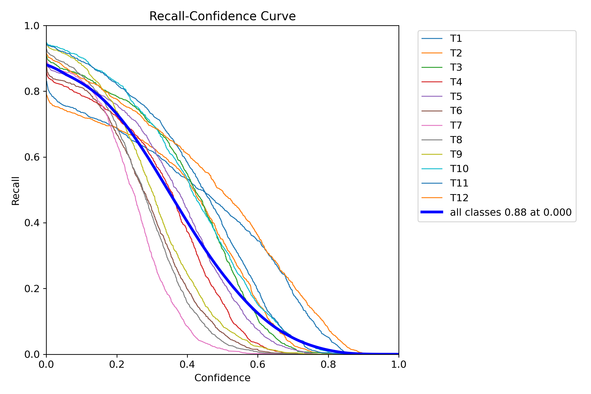  |

## Анализ матрицы ошибок

На основе `confusion_matrix.png` выявлены следующие закономерности:

### Основные типы ошибок
1. **Путаница между соседними позвонками** (наиболее частый тип ошибок):
   - T3-T4: 186 случаев
   - T4-T5: 308 случаев
   - T5-T6: 416 случаев
   
2. **Проблемы с крайними позвонками:**
   - **T1:** 40 случаев путаницы с фоном
   - **T12:** 333 случаев путаницы с фоном и 1075 случаев с T11

3. **Ложные срабатывания на фоне:**
   - Наибольшее количество для позвонков T6-T9

## Рекомендации по использованию модели
### Оптимальные параметры инференса

model(img_rgb, conf=0.265, iou=0.45, max_det=15)

# Дообучение модели

1. **Применение CLAHE**
2. **Аугментация тренировочных данных:**
   - Коррекция яркости/контраста (RandomBrightnessContrast)
   - Повороты до 10° 
   - Сдвиг, масштабирование, вращение (ShiftScaleRotate)
   - Добавление шума (GaussNoise, ISONoise)

### Конфигурация:
- **train:** Применена полная аугментация + CLAHE
- **val:** Только CLAHE (без геометрических трансформаций)
- **Аугментация:** Албументации (Albumentations)
- **Препроцессинг:** Автоматическое применение ко всем изображениям

## 📊 Сравнение результатов до и после дообучения
### Качество детекции позвонков (Bounding Box)
| Метрика | ДО дообучения (88 эпох) | ПОСЛЕ дообучения (30 эпох) | Изменение |
|---------|------------------------|---------------------------|-----------|
| **mAP@50** | **0.982** | **0.966** | **-0.016** |
| **mAP@50-95** | **0.739** | **0.679** | **-0.060** |
| **Precision** | 0.964 | 0.894 | -0.070 |
| **Recall** | 0.957 | 0.881 | -0.076 |

### Качество сегментации контуров (Mask)
| Метрика | ДО дообучения (88 эпох) | ПОСЛЕ дообучения (30 эпох) | Изменение |
|---------|------------------------|---------------------------|-----------|
| **mAP@50** | **0.943** | **0.912** | **-0.031** |
| **mAP@50-95** | **0.540** | **0.490** | **-0.050** |
| **Precision** | 0.926 | 0.894 | -0.032 |
| **Recall** | 0.909 | 0.881 | -0.028 |

По результатам дообучения модель получила более низнкие показатели, однако на практике модель стала корретно распознавать больше снимков, чем до аугментации.

## 📊 Примеры работы модели

### Пример работы модели до/после дообучения
|    Без аугментации   |   После аугментации  |
|----------------------|----------------------|
|  | 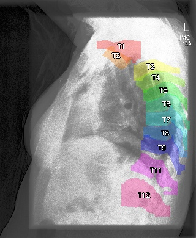 |

Также модель стала распознгавать снимки, которые не могла распознать без аугментации. Примеры приведены ниже.

### Пример 1: 
| Исходное изображение | Результат сегментации |
|----------------------|----------------------|
|  | 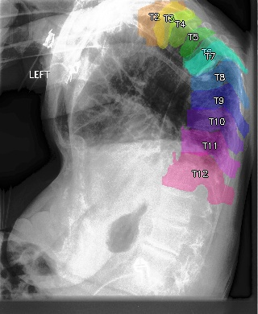 |

### Пример 2: 
| Исходное изображение | Результат сегментации |
|----------------------|----------------------|
|  |  |

### Пример 3: 
| Исходное изображение | Результат сегментации |
|----------------------|----------------------|
|  | 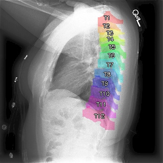 |

### Пример 4: 
| Исходное изображение | Результат сегментации |
|----------------------|----------------------|
|  | 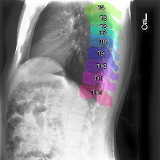 |

